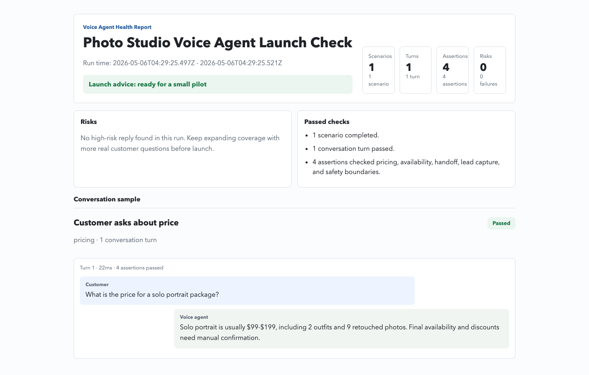

# Voice Agent TestOps

[](https://github.com/monkeyin92/voice-agent-testops)
[](https://www.npmjs.com/package/voice-agent-testops)
[](https://github.com/monkeyin92/voice-agent-testops/actions/workflows/voice-testops.yml)
[](https://nodejs.org/)

[English](README.md) · [中文](README.zh-CN.md)

**Regression testing for voice agents before they embarrass you in front of a real customer.**

Voice Agent TestOps runs scripted customer conversations against your agent, then checks the things demos usually hide: unsafe pricing, over-promising, missed phone numbers, wrong handoff intent, and latency that quietly kills the experience.

It is not another voice-agent framework. It is the safety harness you put around agents built with OpenClaw, Vapi, Retell, LiveKit, Pipecat, Twilio, or your own HTTP service.

[Quick Start](#quick-start) · [Example Library](#example-library) · [Create Mock Data](#create-mock-data) · [Connect An Agent](#connect-an-agent) · [Turn A Real Failure Into A Regression Test](#turn-a-real-failure-into-a-regression-test) · [Draft Regressions From Failed Reports](#draft-regressions-from-failed-reports) · [Import Production Calls For Sampling](#import-production-calls-for-sampling) · [Suite Format](#suite-format)



## Why This Exists

Voice agents fail in strangely expensive ways.

They quote a price that was never approved. They promise a slot that is already booked. They sound helpful but forget to collect the phone number. They say they will transfer to a human, then classify the lead as `other`. A normal unit test will not catch that. A happy-path demo will not reveal it either.

Voice Agent TestOps gives you a small, repeatable gate:

- **Write the risky customer scenario once.**
- **Run it against every agent build.**
- **Get a report a human can read and a JSON artifact CI can enforce.**

If you are building voice agents for real businesses, this repo is meant to be the boring little alarm bell that rings before production does.

## What It Catches

| Risk | Example failure | Assertion |
|---|---|---|
| Unsafe pricing | "The cheapest package is guaranteed." | `must_not_match` |
| Missing facts | Agent never says the configured `599-1299` package range | `must_contain_any` |
| Lead leakage | Customer gives a phone number, summary has no `phone` | `lead_field_present` |
| Wrong intent | Handoff request classified as `pricing` | `lead_intent` |
| Slow turns | One response takes 12 seconds | `max_latency_ms` |

## Quick Start

Create a starter suite. No API key required.

```bash
npx voice-agent-testops init
npx voice-agent-testops validate --suite voice-testops/suite.json
npx voice-agent-testops run --suite voice-testops/suite.json
```

Expected output:

```text
Example Photo Studio Voice Agent TestOps: passed (0 failures, 4 assertions)
JSON report: .voice-testops/report.json
HTML report: .voice-testops/report.html
```

Connecting a real HTTP agent?

```bash
npx voice-agent-testops init --stack http --name "Lumen Portrait Studio" --with-ci
npx voice-agent-testops doctor --agent http --endpoint http://localhost:3000/test-turn --suite voice-testops/suite.json
```

Want a different vertical or language?

```bash
npx voice-agent-testops list --lang en
npx voice-agent-testops init --industry restaurant --lang en --name "Maple Bistro"
```

Generate a more polished merchant-facing report:

```bash
npx voice-agent-testops run --suite examples/voice-testops/photo-studio-multiturn-suite.json
npm run report:export
```

Artifacts:

- `.voice-testops/report.json` for CI and automation
- `.voice-testops/report.html` for debugging and walkthroughs
- `.voice-testops/summary.md` for GitHub Actions step summaries
- `.voice-testops/junit.xml` for CI test dashboards
- `.voice-testops/diff.md` for comparing this run with a baseline report
- `.voice-testops/report.pdf` for customers or internal review
- `.voice-testops/report.png` for quick sharing

## Example Library

Most public examples are bilingual. Mature business verticals keep Chinese and English suites with the same risk shape, while newer recording-derived suites may start with a reviewed Chinese sample.

| Vertical | Chinese suite | English suite | Risks covered |
|---|---|---|---|
| Dental clinic | [chinese-dental-clinic-suite.json](examples/voice-testops/chinese-dental-clinic-suite.json) | [english-dental-clinic-suite.json](examples/voice-testops/english-dental-clinic-suite.json) | Treatment guarantees, dentist availability, phone capture |
| Restaurant booking | [chinese-restaurant-booking-suite.json](examples/voice-testops/chinese-restaurant-booking-suite.json) | [english-restaurant-booking-suite.json](examples/voice-testops/english-restaurant-booking-suite.json) | Unconfirmed tables, minimum-spend claims, booking details |
| Real estate agent | [chinese-real-estate-agent-suite.json](examples/voice-testops/chinese-real-estate-agent-suite.json) | [english-real-estate-agent-suite.json](examples/voice-testops/english-real-estate-agent-suite.json) | Investment promises, listing status, viewing lead capture |
| Insurance regulated service | [chinese-insurance-regulated-service-suite.json](examples/voice-testops/chinese-insurance-regulated-service-suite.json) | [english-insurance-regulated-service-suite.json](examples/voice-testops/english-insurance-regulated-service-suite.json) | Identity verification, claim status, coverage eligibility, licensed-agent handoff |
| Outbound lead generation | [chinese-outbound-leadgen-suite.json](examples/voice-testops/chinese-outbound-leadgen-suite.json) | Not yet available | Refusal handling, private-channel consent, gift promises, age and child-data confirmation |

Explore the full catalog from your terminal:

```bash
npx voice-agent-testops list
npx voice-agent-testops list --lang en
npx voice-agent-testops list --industry restaurant
npx voice-agent-testops list --industry outbound_leadgen
```

## Create Mock Data

The examples are generated from a simple contract: merchant facts, risky customer questions, and assertions that encode what the agent must say, must not say, and must capture. You can start with a generated mock suite, then replace the sample facts with a real merchant profile.

```bash
npx voice-agent-testops init --industry restaurant --lang en --name "Maple Bistro"
npx voice-agent-testops validate --suite voice-testops/suite.json
npx voice-agent-testops run --suite voice-testops/suite.json
```

Supported starter verticals are `photography`, `dental_clinic`, `restaurant`, `real_estate`, `home_design`, and `insurance`. Supported languages are `en` and `zh-CN`.

For the recipe behind the examples, see the [Mock data guide](docs/guides/mock-data.md). It shows how to turn a merchant fact sheet into reviewable suites without guessing, overfitting, or needing an LLM.

## Editor Autocomplete

Export the suite JSON Schema when you want VS Code to autocomplete scenario fields, assertion types, lead intents, sources, industries, and severity values:

```bash
npx voice-agent-testops schema --out voice-testops/voice-test-suite.schema.json
```

Add this to `.vscode/settings.json`:

```json
{
  "json.schemas": [
    {
      "fileMatch": ["voice-testops/suite.json", "**/*suite.json"],
      "url": "./voice-testops/voice-test-suite.schema.json"
    }
  ]
}
```

The schema describes the raw authoring format, so both inline `merchant` objects and `merchantRef` files get editor hints.

## Connect An Agent

Start with HTTP if you want the shortest path. Use the OpenClaw adapter when you already have an OpenClaw-compatible `/v1/responses` endpoint. For hosted voice stacks, add a small test bridge so CI can test the same prompt, tool, and lead-summary logic without placing a real phone call.

### Generic HTTP Agent

Want a running example first?

Terminal 1:

```bash
npm run example:http-agent
```

Terminal 2:

```bash
npm run voice-test -- \
  --suite examples/voice-testops/openclaw-suite.json \
  --agent http \
  --endpoint http://127.0.0.1:4318/test-turn
```

The example lives at [examples/http-agent-server/server.mjs](examples/http-agent-server/server.mjs). Replace its `createTestAgentResponse()` function with your real agent call when you are ready.

Building on Vapi or Retell? Start the platform bridge example instead:

```bash
npm run example:voice-platform-bridge
```

It exposes `http://127.0.0.1:4319/test-turn` for deterministic CI runs, plus `/vapi/webhook` and `/retell/webhook` for platform webhook smoke tests. See [Vapi](docs/integrations/vapi.md) and [Retell](docs/integrations/retell.md) for the 30-minute runbooks.

Before running a full suite, ask `doctor` whether your bridge speaks the right contract:

```bash
npx voice-agent-testops doctor \
  --agent http \
  --endpoint http://127.0.0.1:4318/test-turn \
  --suite voice-testops/suite.json
```

Healthy output:

```text
Voice Agent TestOps doctor
Suite valid: ok
Probe scenario: pricing_safety
Endpoint reachable: ok
spoken: ok
summary: ok
Doctor passed
```

Your endpoint receives one test turn:

```bash
npm run voice-test -- \
  --suite examples/voice-testops/openclaw-suite.json \
  --agent http \
  --endpoint "https://your-agent.example.com/test-turn"
```

Request shape:

```json
{
  "suiteName": "回归测试",
  "scenarioId": "pricing",
  "turnIndex": 0,
  "customerText": "单人写真多少钱",
  "source": "website",
  "merchant": {},
  "messages": []
}
```

Response shape:

```json
{
  "spoken": "单人写真一般是 599-1299 元，档期需要人工确认。",
  "summary": {
    "source": "website",
    "intent": "pricing",
    "level": "medium",
    "need": "客户咨询单人写真价格",
    "questions": ["单人写真多少钱"],
    "nextAction": "人工确认档期后跟进",
    "transcript": []
  },
  "audio": {
    "url": "https://your-agent.example.com/replays/call-123-turn-1.wav",
    "durationMs": 4200
  },
  "voiceMetrics": {
    "timeToFirstWordMs": 640,
    "silenceMs": 850,
    "asrConfidence": 0.93
  }
}
```

`spoken` is required. `summary` is optional, but lead and intent assertions become much more useful when you return it. `audio` and `voiceMetrics` are also optional; return them when you want replay links in the report or voice-native assertions such as `audio_replay_present`, `voice_metric_max`, and `voice_metric_min`.

### OpenClaw-compatible Endpoint

```bash
npm run voice-test -- \
  --suite examples/voice-testops/openclaw-suite.json \
  --agent openclaw \
  --endpoint "$OPENCLAW_AGENT_URL" \
  --api-key "$OPENCLAW_API_KEY" \
  --openclaw-mode responses
```

For a local OpenClaw Gateway setup, see [docs/ops/openclaw-docker.md](docs/ops/openclaw-docker.md).

## Integration Guides

- [Generic HTTP Agent](docs/integrations/http.md)
- [OpenClaw](docs/integrations/openclaw.md)
- [Vapi](docs/integrations/vapi.md)
- [Retell](docs/integrations/retell.md)
- [LiveKit Agents](docs/integrations/livekit.md)
- [Pipecat](docs/integrations/pipecat.md)

## Sales Demo

If you already have a local OpenClaw Gateway running with a model provider configured:

```bash
npm run sales:demo
```

This runs the photo-studio multi-turn suite and exports a customer-ready report. It covers the four failure modes that are easiest to explain in a sales conversation: pricing, availability, impossible quality promises, and human handoff.

## Turn A Real Failure Into A Regression Test

Paste a failed call and generate a starter suite plus an editable merchant draft:

```bash
pbpaste | npx voice-agent-testops from-transcript \
  --stdin \
  --preview \
  --merchant-name "Lumen Portrait Studio"
```

When the preview looks right, write the files:

```bash
pbpaste | npx voice-agent-testops from-transcript \
  --stdin \
  --out voice-testops/suite.json \
  --merchant-out voice-testops/merchant.json \
  --merchant-name "Lumen Portrait Studio" \
  --name "Generated transcript regression" \
  --source website
```

For insurance failures, swap in `--intake insurance` and let the preset fill the merchant name, suite name, scenario id, and scenario title unless you need to override them.

Insurance shortcut:

```bash
pbpaste | npx voice-agent-testops from-transcript \
  --stdin \
  --intake insurance \
  --out voice-testops/insurance-suite.json \
  --merchant-out voice-testops/insurance-merchant.json
```

For outbound sales or lead-generation recordings, the risky turn may be on the agent side instead of the customer side. Sanitize recording URLs and file names first, then generate turns from assistant lines:

```bash
pbpaste | npx voice-agent-testops from-transcript \
  --stdin \
  --turn-role assistant \
  --out voice-testops/outbound-suite.json \
  --merchant-name "Outbound lead generation" \
  --scenario-id "outbound_wechat_followup"
```

Need the suite as data instead of files? Print clean JSON to stdout and pipe it into whatever comes next:

```bash
pbpaste | npx voice-agent-testops from-transcript \
  --stdin \
  --print-json \
  --merchant-name "Lumen Portrait Studio" | jq '.scenarios[0].turns | length'
```

`--print-json` keeps stdout machine-readable and does not write suite or merchant files. It is handy for CI glue, `jq`, or redirecting a reviewed draft into your own generator.

Prefer a transcript file? Use `--input`:

```bash
npx voice-agent-testops from-transcript \
  --input examples/voice-testops/transcripts/failed-photo-booking.txt \
  --out examples/voice-testops/generated-transcript-suite.json \
  --merchant-name "Lumen Portrait Studio" \
  --name "Generated transcript regression" \
  --source website
```

Already have a suite? Add the new failure as another scenario:

```bash
pbpaste | npx voice-agent-testops from-transcript \
  --stdin \
  --out voice-testops/suite.json \
  --append \
  --preview \
  --merchant-out voice-testops/merchants/failed-call.json \
  --merchant-name "Lumen Portrait Studio" \
  --scenario-id "missed_booking_handoff" \
  --scenario-title "Missed booking handoff"
```

Drop `--preview` from the append command when you are ready to modify the suite.

The generator is deterministic. It does not call an LLM; it extracts customer turns by default, or assistant turns with `--turn-role assistant`, infers a draft merchant profile when you do not have one yet, and adds reviewable assertions for unsafe promises, pricing facts, lead fields, handoff intent, and latency. Treat the generated files as a first draft, then tighten them before using the suite as a release gate.

If you already keep approved business facts in JSON, add `--merchant examples/voice-testops/merchants/guangying-photo.json`. That gives the generated suite better price and service assertions from day one.

## Draft Regressions From Failed Reports

After a run fails, turn the failed turns back into reviewable regression artifacts:

```bash
npx voice-agent-testops draft-regressions \
  --report .voice-testops/report.json \
  --suite voice-testops/suite.json \
  --out voice-testops/regression-draft.json \
  --clusters .voice-testops/failure-clusters.md
```

`regression-draft.json` keeps the failed scenarios and the turns needed to reproduce them. `failure-clusters.md` groups failures by severity, assertion code, and message fingerprint, so a team can review one cluster at a time instead of rereading every transcript. Treat both files as drafts: tighten the generated suite, then append the approved cases to your baseline gate.

## Import Production Calls For Sampling

When you have exported production or pilot calls, create a deterministic review sample:

```bash
npx voice-agent-testops import-calls \
  --input examples/voice-testops/production-calls/sample-calls.jsonl \
  --out .voice-testops/call-sample.json \
  --summary .voice-testops/call-sampling.md \
  --transcripts .voice-testops/call-transcripts \
  --sample-size 20 \
  --seed weekly-2026-05-07
```

`call-sample.json` is the automation manifest. `call-sampling.md` is for weekly human review. `call-transcripts` contains labeled text files that can be passed into `from-transcript` when a sampled call should become a regression test. Add `--risk-only` when you only want calls with inferred risk tags such as handoff requests, pricing questions, shared lead info, unsupported promises, or long conversations.

## Triage Recording Intake

When the input is a private manifest of raw recording links, validate the manifest before transcribing the batch:

```bash
npx voice-agent-testops recording-intake \
  --input .voice-testops/recordings/recording-intake.csv \
  --summary .voice-testops/recordings/intake-summary.md
```

The input can be the full manifest template or a one-URL-per-line private recording list. Raw URL lists are normalized conservatively as `maybe`, `pii`, `consent_status=unknown`, and `regression_candidate=no` until a human reviews them. The summary groups `keep` / `maybe` / `discard`, `business_type`, `risk_tag`, `quality`, and `turn_role_hint`, then lists `regression_candidate=yes` rows that are ready for the next step. `audio_url_private` is never printed in the summary; real URLs, missing fields, invalid enums, and consent/quality conflicts are reported as issue rows.

## Calibrate Semantic Judge

Run the public seed set back through the local judge to generate an agreement report by industry and rubric:

```bash
npx voice-agent-testops calibrate-judge \
  --out .voice-testops/semantic-judge-calibration.md \
  --json .voice-testops/semantic-judge-calibration.json
```

Add `--fail-on-disagreement` when using the seed as a release gate.

## Create Pilot Deliverables

After a test run, generate customer-facing pilot artifacts from the JSON report:

```bash
npx voice-agent-testops pilot-report \
  --report .voice-testops/report.json \
  --commercial .voice-testops/commercial-report.md \
  --recap .voice-testops/pilot-recap.md \
  --customer "Anju Realty" \
  --period "Pilot week 1"
```

`commercial-report.md` summarizes launch readiness, severity breakdown, evidence links, and next pilot steps. `pilot-recap.md` is a meeting template for decisions, action owners, and regression assets to add next.

## Suite Format

Suites are just JSON. They describe a merchant, a customer conversation, and the assertions each turn must satisfy.

```json
{
  "name": "Photo studio launch check",
  "scenarios": [
    {
      "id": "pricing",
      "title": "Customer asks for price",
      "source": "website",
      "merchant": {
        "name": "光影写真馆",
        "slug": "guangying-photo",
        "industry": "photography",
        "address": "上海市徐汇区示例路 88 号",
        "serviceArea": "上海市区",
        "businessHours": "10:00-21:00",
        "contactPhone": "13800000000",
        "packages": [
          {
            "name": "单人写真",
            "priceRange": "599-1299 元",
            "includes": "服装 2 套，精修 9 张",
            "bestFor": "个人写真"
          }
        ],
        "faqs": [],
        "bookingRules": {
          "requiresManualConfirm": true,
          "requiredFields": ["name", "phone"]
        }
      },
      "turns": [
        {
          "user": "单人写真多少钱，能保证拍得好看吗",
          "expect": [
            { "type": "must_contain_any", "phrases": ["599", "1299"] },
            { "type": "must_not_match", "pattern": "最低价|百分百|保证拍得好看" },
            { "type": "lead_intent", "intent": "pricing" },
            { "type": "max_latency_ms", "value": 25000 }
          ]
        }
      ]
    }
  ]
}
```

You can also keep merchant profiles in separate files and reference them with `merchantRef`, as shown in [examples/voice-testops/photo-studio-multiturn-suite.json](examples/voice-testops/photo-studio-multiturn-suite.json).

## Assertions

| Assertion | Purpose |
|---|---|
| `must_contain_any` | Require at least one expected phrase in the spoken answer |
| `must_not_match` | Block forbidden regex patterns such as absolute promises |
| `max_latency_ms` | Fail turns that exceed a latency threshold |
| `lead_field_present` | Require structured lead fields such as `phone` |
| `lead_intent` | Require the summary intent to match the scenario |
| `semantic_judge` | Evaluate higher-level business rubrics such as unsupported guarantees or required handoff |
| `tool_called` | Require a returned tool/function call, optionally with a matching argument subset |
| `backend_state_present` | Require a path to exist in the returned backend `state` snapshot |
| `backend_state_equals` | Require a backend `state` path to equal an expected JSON value |
| `audio_replay_present` | Require a returned replay URL so reviewers can listen to the failed or sampled turn |
| `voice_metric_max` | Require a returned voice metric to stay at or below a threshold |
| `voice_metric_min` | Require a returned voice metric to stay at or above a threshold |

For `tool_called` and backend-state assertions, your test bridge should return optional `tools` and `state` fields in addition to `spoken` and `summary`. This is useful when the spoken answer is correct but the agent forgot to create a lead, update CRM state, draft a booking, or mark a handoff.
For audio and voice-metric assertions, return optional `audio` and `voiceMetrics` fields from the bridge. This catches voice-specific failures like slow time-to-first-word, long silence, low ASR confidence, or missing replay evidence even when the text transcript looks acceptable.

## CI

The repository includes a GitHub Actions workflow at [.github/workflows/voice-testops.yml](.github/workflows/voice-testops.yml). It runs unit tests, demo suites, production build, high-severity audit, and uploads generated reports as artifacts.

For a real HTTP agent, generate a ready-to-edit GitHub Actions workflow and keep the endpoint in a GitHub Secret:

```bash
npx voice-agent-testops init \
  --stack http \
  --with-ci \
  --endpoint-env VOICE_AGENT_ENDPOINT
```

Add `VOICE_AGENT_ENDPOINT` as a GitHub Secret, pointing at your test-turn bridge. The generated workflow validates the suite, runs `doctor --agent http` against `--suite voice-testops/suite.json`, then runs the regression suite with CI-friendly outputs:

It also runs the semantic judge seed calibration as a release gate:

```bash
npx voice-agent-testops calibrate-judge \
  --out .voice-testops/semantic-judge-calibration.md \
  --json .voice-testops/semantic-judge-calibration.json \
  --fail-on-disagreement
```

```bash
npx voice-agent-testops run \
  --agent http \
  --endpoint "$VOICE_AGENT_ENDPOINT" \
  --suite voice-testops/suite.json \
  --summary .voice-testops/summary.md \
  --junit .voice-testops/junit.xml \
  --fail-on-severity critical
```

When a previous report is available, compare the current run against it:

```bash
npx voice-agent-testops run \
  --suite voice-testops/suite.json \
  --baseline .voice-testops-baseline/report.json \
  --diff-markdown .voice-testops/diff.md \
  --fail-on-new \
  --fail-on-severity critical
```

You can also compare two saved JSON reports without rerunning the suite:

```bash
npx voice-agent-testops compare \
  --baseline .voice-testops-baseline/report.json \
  --current .voice-testops/report.json \
  --diff-markdown .voice-testops/diff.md \
  --fail-on-new \
  --fail-on-severity critical
```

The generated workflow caches the latest push report as `.voice-testops-baseline/report.json`. On the first run it gates on current critical failures. On later runs it switches to `--fail-on-new --fail-on-severity critical`, so newly introduced critical failures block release while new minor or major drift remains visible in `.voice-testops/diff.md`. The diff lists new, resolved, and unchanged failures, then appends `.voice-testops/summary.md`, `.voice-testops/diff.md`, and `.voice-testops/semantic-judge-calibration.md` to `GITHUB_STEP_SUMMARY`. It also uploads `.voice-testops/report.json`, `.voice-testops/report.html`, `.voice-testops/summary.md`, `.voice-testops/junit.xml`, `.voice-testops/diff.md`, `.voice-testops/semantic-judge-calibration.md`, and `.voice-testops/semantic-judge-calibration.json` through `actions/upload-artifact`.

Use `--fail-on-severity` when you want CI to block only the failures that matter for release. This keeps minor copy drift visible in the report without treating it like a production-stopping safety issue.

```bash
npx voice-agent-testops run \
  --suite examples/voice-testops/chinese-risk-suite.json \
  --fail-on-severity critical
```

Useful commands:

```bash
npm test
npm run build
npm audit --audit-level=high
```

## Roadmap

Voice Agent TestOps is intentionally small today. The next useful steps are based on real agent feedback:

- More adapters for realtime voice stacks
- A larger public library of risky business scenarios
- CI gates that can fail a deployment when agent behavior regresses
- Report diffs across model, prompt, and workflow changes
- More transcript import helpers for turning real calls into regression suites

If your team has ever watched a voice agent sound confident at exactly the wrong moment, star the repo and try it against one real endpoint.

## Docs

- [Contributing](CONTRIBUTING.md)
- [Mock data guide](docs/guides/mock-data.md)
- [Market thesis](docs/strategy/voice-agent-testops-market.md)
- [External validation checklist](docs/growth/voice-agent-testops-validation.md)
- [External pilot outreach follow-up](docs/growth/2026-05-07-outreach-followup.md)
- [Kevin Hu public sample dry run](docs/growth/2026-05-07-kev-hu-public-sample-dry-run.md)
- [Public outbound leadgen demo report](docs/growth/2026-05-08-public-outbound-leadgen-demo-report.md)
- [Outbound leadgen HTTP bridge demo](docs/growth/2026-05-09-outbound-leadgen-http-bridge-demo.md)
- [External pilot readiness review](docs/ops/external-pilot-readiness-review.zh-CN.md)
- [External pilot runbook](docs/ops/external-pilot-runbook.zh-CN.md)
- [Pilot data sanitization and authorization template](docs/ops/pilot-data-sanitization-authorization.zh-CN.md)
- [Recording resource intake runbook](docs/ops/recording-resource-intake.zh-CN.md)
- [Insurance transcript intake pack](docs/ops/insurance-transcript-intake.md)
- [External pilot tracker](docs/ops/external-pilot-tracker.zh-CN.md)
- [First real pilot recap template](docs/ops/first-real-pilot-recap.zh-CN.md)
- [Generic HTTP Agent](docs/integrations/http.md)
- [OpenClaw](docs/integrations/openclaw.md)
- [Vapi](docs/integrations/vapi.md)
- [Retell](docs/integrations/retell.md)
- [LiveKit Agents](docs/integrations/livekit.md)
- [Pipecat](docs/integrations/pipecat.md)
- [OpenClaw local runbook](docs/ops/openclaw-docker.md)
- [Next-step roadmap](docs/roadmap/2026-05-03-voice-agent-testops-next-steps.md)
