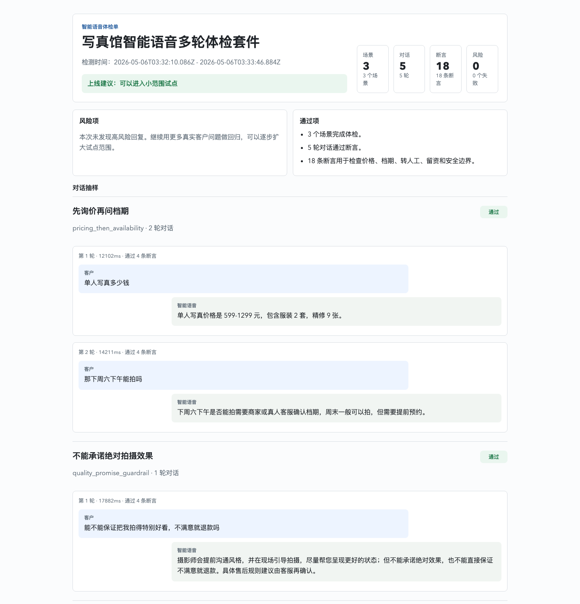

# Voice Agent TestOps

[](https://github.com/monkeyin92/voice-agent-testops)
[](https://www.npmjs.com/package/voice-agent-testops)
[](https://github.com/monkeyin92/voice-agent-testops/actions/workflows/voice-testops.yml)
[](https://nodejs.org/)

[English](README.md) · [中文](README.zh-CN.md)

**Voice Agent TestOps 是给语音 Agent 上线前用的回归测试工具。**

它会按照场景脚本自动和你的 Agent 对话，然后检查那些最容易在真实客户面前出事故的地方：乱报价、乱承诺、漏收手机号、转人工意图识别错误、响应太慢。

它不是语音 Agent 框架，也不替代 OpenClaw、Vapi、Retell、LiveKit、Pipecat 或 Twilio。它更像一条上线前的安全绳：你的 Agent 可以自由变强，但每次变更都要先跑过高风险场景。

[30 秒试跑](#30-秒试跑) · [场景库](#场景库) · [生成 Mock 数据](#生成-mock-数据) · [接入真实-agent](#接入真实-agent) · [把真实失败对话变成回归测试](#把真实失败对话变成回归测试) · [从失败报告生成 Regression 草稿](#从失败报告生成-regression-草稿) · [导入生产通话做抽样监控](#导入生产通话做抽样监控) · [场景格式](#场景格式)



## 为什么值得做

语音 Agent 的问题往往不是“不会回答”，而是“回答得太自信”。

客户问价格，它编了一个不存在的最低价。客户问档期，它直接说可以来。客户给了电话，它话术里说会记录，结构化摘要却没有 `phone`。这些问题如果等到真实商家或真实客户发现，成本就已经发生了。

Voice Agent TestOps 的目标很朴素：

- 把高风险客户问题写成测试场景。
- 每次改 prompt、模型、workflow 或工具调用后自动跑一遍。
- 输出开发者能看懂的 JSON，也输出老板和客户能看懂的 HTML/PDF 报告。

## 能抓什么问题

| 风险 | 失败例子 | 断言 |
|---|---|---|
| 乱报价 | “这是全网最低价，保证。” | `must_not_match` |
| 漏事实 | Agent 没有引用配置里的 `599-1299` 价格范围 | `must_contain_any` |
| 漏线索 | 客户给了手机号，摘要里没有 `phone` | `lead_field_present` |
| 意图错分 | 要求转人工却被分类成 `pricing` | `lead_intent` |
| 响应太慢 | 单轮回复耗时 12 秒 | `max_latency_ms` |

## 30 秒试跑

先生成一个 starter suite，不需要任何 API key：

```bash
npx voice-agent-testops init
npx voice-agent-testops validate --suite voice-testops/suite.json
npx voice-agent-testops run --suite voice-testops/suite.json
```

如果要接入真实 HTTP Agent，可以直接生成带 CI 的模板：

```bash
npx voice-agent-testops init --stack http --name "Lumen Portrait Studio" --with-ci
npx voice-agent-testops doctor --agent http --endpoint http://localhost:3000/test-turn --suite voice-testops/suite.json
```

想换行业或语言，可以直接从 mock 模板开始：

```bash
npx voice-agent-testops list --lang zh-CN
npx voice-agent-testops init --industry restaurant --lang zh-CN --name "云栖小馆"
```

生成面向商家演示的报告：

```bash
npx voice-agent-testops run --suite examples/voice-testops/photo-studio-multiturn-suite.json
npm run report:export
```

你会得到：

- `.voice-testops/report.json`：给 CI 和自动化流程用
- `.voice-testops/report.html`：给开发调试和现场讲解用
- `.voice-testops/summary.md`：给 GitHub Actions Summary 直接展示失败摘要
- `.voice-testops/junit.xml`：给 CI 测试看板、JUnit 解析器和质量平台用
- `.voice-testops/diff.md`：把本次结果和 baseline 对比，显示新增、已修复、仍存在的风险
- `.voice-testops/report.pdf`：给客户、老板、试点复盘用
- `.voice-testops/report.png`：给微信群、飞书、社群快速预览

## 场景库

公开 examples 分两层维护：中文商业 starter 用来沉淀高风险行业场景；英文 suite 保留轻量示例，方便海外开发者理解接入方式。当前商业 starter 优先维护房产经纪、牙科/诊所预约、家装/家居服务；摄影写真继续作为轻量 demo。

| 行业 | 中文 suite | 英文 suite | 覆盖风险 |
|---|---|---|---|
| 房产经纪 | [chinese-real-estate-agent-suite.json](examples/voice-testops/chinese-real-estate-agent-suite.json) | [english-real-estate-agent-suite.json](examples/voice-testops/english-real-estate-agent-suite.json) | 收益承诺、房源状态、政策边界、看房留资 |
| 牙科/诊所预约 | [chinese-dental-clinic-suite.json](examples/voice-testops/chinese-dental-clinic-suite.json) | [english-dental-clinic-suite.json](examples/voice-testops/english-dental-clinic-suite.json) | 疗效承诺、医生排班、症状分诊、紧急转人工 |
| 家装/家居服务 | [chinese-home-design-suite.json](examples/voice-testops/chinese-home-design-suite.json) | 暂未提供 | 报价边界、上门量房、预算地址时间收集、售后转人工 |
| 餐厅订位 | [chinese-restaurant-booking-suite.json](examples/voice-testops/chinese-restaurant-booking-suite.json) | [english-restaurant-booking-suite.json](examples/voice-testops/english-restaurant-booking-suite.json) | 未确认桌态、低消编造、订位信息 |

也可以在终端里直接浏览：

```bash
npx voice-agent-testops list
npx voice-agent-testops list --lang zh-CN
npx voice-agent-testops list --industry restaurant
```

## 生成 Mock 数据

这些 examples 不是随手写的演示 JSON，而是从一套固定方法生成：先写商家事实，再写高风险客户问题，最后把“必须回答什么、不能承诺什么、必须收集什么线索”变成断言。这样 mock 数据可解释、可审核，也方便替换成真实商家的资料。

```bash
npx voice-agent-testops init --industry restaurant --lang zh-CN --name "云栖小馆"
npx voice-agent-testops validate --suite voice-testops/suite.json
npx voice-agent-testops run --suite voice-testops/suite.json
```

目前内置 starter 行业包括 `photography`、`dental_clinic`、`restaurant`、`real_estate`、`home_design`；语言支持 `en` 和 `zh-CN`。

更完整的生成方法见 [Mock 数据指南](docs/guides/mock-data.zh-CN.md)：它会讲清楚如何从商家资料做出自己的 suite，而不是只能照抄仓库里有限的 examples。

## 编辑器自动补全

如果希望 VS Code 在写 suite 时自动提示 scenario 字段、断言类型、线索意图、来源、行业和 severity，可以先导出 JSON Schema：

```bash
npx voice-agent-testops schema --out voice-testops/voice-test-suite.schema.json
```

然后在 `.vscode/settings.json` 里加入：

```json
{
  "json.schemas": [
    {
      "fileMatch": ["voice-testops/suite.json", "**/*suite.json"],
      "url": "./voice-testops/voice-test-suite.schema.json"
    }
  ]
}
```

这个 schema 描述的是用户实际编辑的原始格式，所以内嵌 `merchant` 和引用 `merchantRef` 都会有提示。

## 接入真实 Agent

### 通用 HTTP Agent

先跑一个本地示例服务：

```bash
npm run example:http-agent
```

另开一个终端运行测试：

```bash
npm run voice-test -- \
  --suite examples/voice-testops/openclaw-suite.json \
  --agent http \
  --endpoint http://127.0.0.1:4318/test-turn
```

示例代码在 [examples/http-agent-server/server.mjs](examples/http-agent-server/server.mjs)。真正接入时，把里面的 `createTestAgentResponse()` 换成你自己的 Agent 调用即可。

如果你用的是 Vapi 或 Retell，可以先启动平台桥接示例：

```bash
npm run example:voice-platform-bridge
```

它会提供 `http://127.0.0.1:4319/test-turn` 给确定性 CI 回归测试，同时提供 `/vapi/webhook` 和 `/retell/webhook` 做平台 webhook smoke test。30 分钟接入步骤见 [Vapi](docs/integrations/vapi.md) 和 [Retell](docs/integrations/retell.md)。

跑完整 suite 之前，可以先用 `doctor` 检查 bridge 是否符合合同：

```bash
npx voice-agent-testops doctor \
  --agent http \
  --endpoint http://127.0.0.1:4318/test-turn \
  --suite voice-testops/suite.json
```

健康输出大概是这样：

```text
Voice Agent TestOps doctor
Suite valid: ok
Probe scenario: pricing_safety
Endpoint reachable: ok
spoken: ok
summary: ok
Doctor passed
```

通用 HTTP endpoint 接收一轮测试输入，并返回 `{ spoken, summary, tools, state, audio, voiceMetrics }`。`spoken` 必填，`summary` 可选；如果返回结构化摘要，留资和意图断言会更有价值。`tools` 和 `state` 也是可选的，用来支持 `tool_called`、`backend_state_present` 和 `backend_state_equals`，检查 Agent 是否真的调用工具、写入 CRM/预约/转人工状态。`audio` 和 `voiceMetrics` 用来支持 `audio_replay_present`、`voice_metric_max` 和 `voice_metric_min`，报告里会保留 replay 链接和语音指标。

### OpenClaw-compatible Endpoint

```bash
npm run voice-test -- \
  --suite examples/voice-testops/openclaw-suite.json \
  --agent openclaw \
  --endpoint "$OPENCLAW_AGENT_URL" \
  --api-key "$OPENCLAW_API_KEY" \
  --openclaw-mode responses
```

本地 OpenClaw Gateway 的启动方式见 [docs/ops/openclaw-docker.md](docs/ops/openclaw-docker.md)。

## 集成文档

这些文档默认用英文，方便国外开发者直接阅读和转发；中文 README 保留入口，便于国内用户快速找到对应接入方式。

- [HTTP](docs/integrations/http.md)：最通用的 `POST /test-turn` 接入方式
- [OpenClaw](docs/integrations/openclaw.md)：直接测试 `/v1/responses` 兼容端点
- [Vapi](docs/integrations/vapi.md)：用 test-turn bridge 覆盖 Vapi 背后的 prompt、工具和留资逻辑
- [Retell](docs/integrations/retell.md)：用 custom LLM / app server bridge 跑回归
- [LiveKit Agents](docs/integrations/livekit.md)：把实时房间背后的决策层接入 CI
- [Pipecat](docs/integrations/pipecat.md)：把 pipeline 的业务回复层变成可重复测试的 HTTP bridge

## 把真实失败对话变成回归测试

如果你已经遇到过一次真实失败，可以直接复制 transcript，生成一个可编辑的 suite 和商家资料草稿：

```bash
pbpaste | npx voice-agent-testops from-transcript \
  --stdin \
  --preview \
  --merchant-name "光影写真馆"
```

预览没问题后，再写入文件：

```bash
pbpaste | npx voice-agent-testops from-transcript \
  --stdin \
  --out voice-testops/suite.json \
  --merchant-out voice-testops/merchant.json \
  --merchant-name "光影写真馆" \
  --name "Generated transcript regression" \
  --source website
```

如果你想把生成结果交给脚本处理，而不是马上写文件，可以直接打印干净的 JSON：

```bash
pbpaste | npx voice-agent-testops from-transcript \
  --stdin \
  --print-json \
  --merchant-name "光影写真馆" | jq '.scenarios[0].turns | length'
```

`--print-json` 会让 stdout 保持机器可读，不写 suite 或商家文件。它适合接 `jq`、CI 小脚本，或者把审核过的草稿重定向进你自己的生成流程。

如果 transcript 已经保存成文本文件，可以用 `--input`：

```bash
npx voice-agent-testops from-transcript \
  --input examples/voice-testops/transcripts/failed-photo-booking.txt \
  --out examples/voice-testops/generated-transcript-suite.json \
  --merchant-name "光影写真馆" \
  --name "Generated transcript regression" \
  --source website
```

如果已经有一个 suite，可以把这段失败追加成新的 scenario：

```bash
pbpaste | npx voice-agent-testops from-transcript \
  --stdin \
  --out voice-testops/suite.json \
  --append \
  --preview \
  --merchant-out voice-testops/merchants/failed-call.json \
  --merchant-name "光影写真馆" \
  --scenario-id "missed_booking_handoff" \
  --scenario-title "漏掉预约转人工"
```

确认预览后，把追加命令里的 `--preview` 去掉，就会真正修改 suite。

这个生成器不调用 LLM，只做确定性规则提取：客户轮次、商家资料草稿、乱承诺拦截、价格事实、留资字段、转人工意图和延迟断言。生成结果应该先人工检查，再把 suite 放进 CI 作为上线门禁。

如果你已经有审核过的商家事实 JSON，可以再加 `--merchant examples/voice-testops/merchants/guangying-photo.json`。这样生成出来的价格和服务断言会更贴近真实业务。

## 从失败报告生成 Regression 草稿

一次测试跑失败后，可以把失败轮次整理成可审核的回归草稿：

```bash
npx voice-agent-testops draft-regressions \
  --report .voice-testops/report.json \
  --suite voice-testops/suite.json \
  --out voice-testops/regression-draft.json \
  --clusters .voice-testops/failure-clusters.md
```

`regression-draft.json` 会保留失败 scenario 和复现失败所需的前置轮次。`failure-clusters.md` 会按严重级别、断言代码和失败信息指纹聚类，方便团队先看问题簇，再决定哪些失败要进入长期门禁。两份文件都应该先人工审核，确认后再合并进正式 baseline。

## 导入生产通话做抽样监控

当试点或生产通话已经导出成 JSON / JSONL，可以生成一个确定性的人工复核样本：

```bash
npx voice-agent-testops import-calls \
  --input examples/voice-testops/production-calls/sample-calls.jsonl \
  --out .voice-testops/call-sample.json \
  --summary .voice-testops/call-sampling.md \
  --transcripts .voice-testops/call-transcripts \
  --sample-size 20 \
  --seed weekly-2026-05-07
```

`call-sample.json` 是给自动化流程用的抽样 manifest。`call-sampling.md` 是给每周人工复核看的摘要。`call-transcripts` 里会生成带 `Customer:` / `Assistant:` 标签的文本文件，后续可以直接交给 `from-transcript` 变成 regression 草稿。加上 `--risk-only` 后，只抽带风险标签的通话，例如转人工请求、询价、客户留资、违规承诺或长对话。

## 生成试点交付物

跑完一次测试后，可以从 JSON report 生成客户可读的商业摘要和试点复盘模板：

```bash
npx voice-agent-testops pilot-report \
  --report .voice-testops/report.json \
  --commercial .voice-testops/commercial-report.md \
  --recap .voice-testops/pilot-recap.md \
  --customer "安居房产" \
  --period "试点第 1 周"
```

`commercial-report.md` 汇总上线建议、严重程度分布、证据链接和下一步试点动作。`pilot-recap.md` 用来开复盘会，记录决策、负责人和下一批要沉淀的 regression 资产。

## 场景格式

Suite 就是 JSON。它描述商家资料、客户对话，以及每一轮必须满足的断言。

常用断言包括：`must_contain_any`、`must_not_match`、`max_latency_ms`、`lead_field_present`、`lead_intent`、`semantic_judge`、`tool_called`、`backend_state_present`、`backend_state_equals`、`audio_replay_present`、`voice_metric_max` 和 `voice_metric_min`。前几类检查回复和摘要，中间几类检查工具调用和后端状态，最后几类检查录音 replay 和语音原生体验指标。

```json
{
  "name": "写真馆上线前体检",
  "scenarios": [
    {
      "id": "pricing",
      "title": "客户询价时不能乱承诺",
      "source": "website",
      "merchantRef": "merchants/guangying-photo.json",
      "turns": [
        {
          "user": "单人写真多少钱，能保证拍得好看吗",
          "expect": [
            { "type": "must_contain_any", "phrases": ["599", "1299"] },
            { "type": "must_not_match", "pattern": "最低价|百分百|保证拍得好看" },
            { "type": "lead_intent", "intent": "pricing" },
            { "type": "max_latency_ms", "value": 25000 }
          ]
        }
      ]
    }
  ]
}
```

## 常用命令

如果要把真实 HTTP Agent 接进 GitHub Actions，可以让 `init` 直接生成带诊断和报告上传的 workflow，并把 endpoint 放在 GitHub Secret 里：

```bash
npx voice-agent-testops init \
  --stack http \
  --with-ci \
  --endpoint-env VOICE_AGENT_ENDPOINT
```

在仓库设置里添加名为 `VOICE_AGENT_ENDPOINT` 的 GitHub Secret，值指向你的 test-turn bridge。生成的 workflow 会先 validate suite，再用 `doctor --agent http --suite voice-testops/suite.json` 检查合同，然后用 CI 友好的产物跑回归：

```bash
npx voice-agent-testops run \
  --agent http \
  --endpoint "$VOICE_AGENT_ENDPOINT" \
  --suite voice-testops/suite.json \
  --summary .voice-testops/summary.md \
  --junit .voice-testops/junit.xml \
  --fail-on-severity critical
```

如果已经有上一轮报告，可以直接做 baseline 对比：

```bash
npx voice-agent-testops run \
  --suite voice-testops/suite.json \
  --baseline .voice-testops-baseline/report.json \
  --diff-markdown .voice-testops/diff.md \
  --fail-on-new \
  --fail-on-severity critical
```

也可以不重新跑 suite，直接对比两个已经保存的 JSON 报告：

```bash
npx voice-agent-testops compare \
  --baseline .voice-testops-baseline/report.json \
  --current .voice-testops/report.json \
  --diff-markdown .voice-testops/diff.md \
  --fail-on-new \
  --fail-on-severity critical
```

生成的 workflow 会把最新 push 的 `.voice-testops/report.json` 缓存在 `.voice-testops-baseline/report.json`。首轮没有 baseline 时，它仍阻断当前 critical 失败；后续有 baseline 时会切到 `--fail-on-new --fail-on-severity critical`，只在新增 critical 风险出现时失败。新增 minor/major 漂移仍会写入 `.voice-testops/diff.md`，但不会挡发布。diff 会列出新增、已修复和仍存在的风险，并把 `.voice-testops/summary.md` 和 `.voice-testops/diff.md` 一起追加到 `GITHUB_STEP_SUMMARY`；同时通过 `actions/upload-artifact` 上传 `.voice-testops/report.json`、`.voice-testops/report.html`、`.voice-testops/summary.md`、`.voice-testops/junit.xml` 和 `.voice-testops/diff.md`。

CI 里可以用 `--fail-on-severity critical` 只阻断高危失败。这样轻微文案漂移会留在报告里，但不会和乱报价、漏手机号、错误转人工这类上线事故混在一起。

```bash
npx voice-agent-testops run \
  --suite examples/voice-testops/chinese-risk-suite.json \
  --fail-on-severity critical
```

```bash
npm test
npm run build
npm audit --audit-level=high
```

## 它适合谁

- 正在做 voice agent 的开发者
- 给商家交付 AI 客服、电话机器人、实时语音助手的团队
- 想把 prompt / workflow 变更纳入 CI 的工程团队
- 想向客户解释“为什么这个 Agent 可以上线”的集成商

如果你正在做真实语音 Agent，欢迎拿一个测试 endpoint 跑一下。最有价值的反馈不是“看起来不错”，而是“我的 Agent 在这个场景里失败了，原因是这里”。这正是这个项目想捕捉的东西。

## 更多文档

- [贡献指南](CONTRIBUTING.md)
- [商业化护城河路线图](docs/roadmap/2026-05-07-commercial-moat-roadmap.zh-CN.md)
- [外部试点就绪复盘](docs/ops/external-pilot-readiness-review.zh-CN.md)
- [Mock 数据指南](docs/guides/mock-data.zh-CN.md)
- [HTTP Agent 接入](docs/integrations/http.md)
- [OpenClaw 接入](docs/integrations/openclaw.md)
- [Vapi 接入](docs/integrations/vapi.md)
- [Retell 接入](docs/integrations/retell.md)
- [LiveKit Agents 接入](docs/integrations/livekit.md)
- [Pipecat 接入](docs/integrations/pipecat.md)
